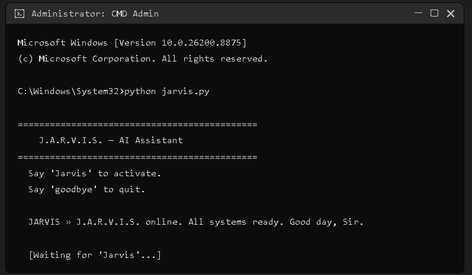
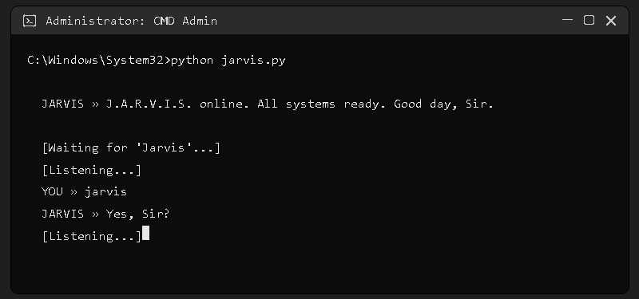
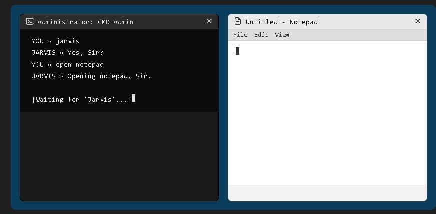

# 🤖 J.A.R.V.I.S. — AI Voice Assistant

<p align="center">
  
</p>

<p align="center">
  
  
  
  
  
</p>

<p align="center">
  A voice-controlled desktop assistant that opens apps, controls your system,
  browses the web, and answers anything — powered by Anthropic's Claude API.
</p>

---

## 📋 Overview

J.A.R.V.I.S. is a Python voice assistant for Windows that listens for a wake
word ("jarvis"), then executes system commands or forwards open-ended
questions to Claude for a natural, conversational reply. It's built as a
single-file assistant that's easy to read, extend, and run locally.

## ✨ Features

| Category | Examples |
| --- | --- |
| 🗣️ Voice control | Wake-word activation, natural spoken commands |
| 🧠 AI conversation | Claude-powered answers for anything outside built-in commands |
| 🚀 App launcher | Notepad, Chrome, VS Code, Spotify, and more |
| 🌐 Web shortcuts | YouTube, GitHub, Gmail, Netflix, LinkedIn, and more |
| 🔍 Search | Google search, YouTube search, Wikipedia lookups |
| 🖥️ System control | Volume, CPU/RAM/disk info, screenshots, lock screen |
| ⚡ Power control | Shutdown, restart, sleep, sign out |
| 📁 File management | Create files, open common folders |
| ⌨️ Typing & clipboard | Type text, copy, paste, undo, select all |
| 🪟 Window control | Minimize, maximize, close, switch windows |

See [`docs/FEATURES.md`](docs/FEATURES.md) for full details and
[`docs/COMMANDS.md`](docs/COMMANDS.md) for every supported phrase.

## 🏗️ Architecture

```
 Microphone ──▶ speech_recognition ──▶ process(cmd)
                                            │
                        ┌───────────────────┼────────────────────┐
                        ▼                   ▼                    ▼
                Built-in handlers     Wikipedia lookup      Claude API (ask_ai)
                (apps, system,        (with AI fallback)    for open-ended
                 power, files, web)                          conversation
                        │                   │                    │
                        └───────────────────┴────────────────────┘
                                            ▼
                                      pyttsx3 (speak)
```

## 🛠️ Technologies used

- **Python 3.11+**
- **Anthropic Claude API** (`anthropic`) — conversational AI brain
- **SpeechRecognition** + Google Speech API — voice-to-text
- **pyttsx3** — text-to-speech
- **PyAutoGUI** — keyboard/mouse simulation, screenshots
- **psutil** — system resource monitoring
- **wikipedia** — knowledge lookups
- **webbrowser** — website and search shortcuts

## 📦 Requirements

- Windows 10/11
- Python 3.11 or newer
- A working microphone
- An [Anthropic API key](https://console.anthropic.com/)
- Internet connection (for speech recognition, search, and Claude)

## ⚙️ Installation

Full step-by-step instructions: [`docs/INSTALLATION.md`](docs/INSTALLATION.md)

Quick start:

```bash
git clone https://github.com/<your-username>/jarvis-assistant.git
cd jarvis-assistant
python -m venv venv
venv\Scripts\activate
pip install -r requirements.txt
copy .env.example .env   # then add your real API key
python jarvis.py
```

## 🔐 API key setup

1. Get a key from the [Anthropic Console](https://console.anthropic.com/).
2. Copy `.env.example` to `.env`.
3. Set:
   ```
   ANTHROPIC_API_KEY=your_real_key_here
   ```
4. Never commit `.env` — it's already excluded in `.gitignore`.

See [`SECURITY.md`](SECURITY.md) for full credential-handling guidance.

## ▶️ Running the project

```bash
python jarvis.py
```

Say **"Jarvis"** → wait for **"Yes, Sir?"** → speak your command.

## 💬 Example commands

```
"Jarvis" → "open notepad"
"Jarvis" → "what's the weather" (routed to Claude)
"Jarvis" → "search for the best pizza near me"
"Jarvis" → "who is Ada Lovelace"
"Jarvis" → "system info"
"Jarvis" → "take a screenshot"
"Jarvis" → "tell me a joke"
"Jarvis" → "goodbye"
```

Full reference: [`docs/COMMANDS.md`](docs/COMMANDS.md)

## 📂 Folder structure

```
jarvis-assistant/
├── jarvis.py
├── requirements.txt
├── .env.example
├── .gitignore
├── LICENSE
├── README.md
├── SECURITY.md
├── CONTRIBUTING.md
├── CHANGELOG.md
├── CODE_OF_CONDUCT.md
├── assets/screenshots/
└── docs/
    ├── PROJECT_STRUCTURE.md
    ├── FEATURES.md
    ├── COMMANDS.md
    ├── INSTALLATION.md
    └── TROUBLESHOOTING.md
```

Details: [`docs/PROJECT_STRUCTURE.md`](docs/PROJECT_STRUCTURE.md)

# 🖼️ Screenshots

## 🚀 Boot & Initialization

J.A.R.V.I.S. starts successfully and waits for the wake word.

<p align="center">

</p>

---

## 🎙️ Wake Word Detection

The assistant recognizes **"Jarvis"** and activates.

<p align="center">

</p>

---

## 💻 Command Execution

J.A.R.V.I.S. launches Windows Notepad using voice commands.

<p align="center">

</p>

## 📚 Libraries used

`anthropic` · `SpeechRecognition` · `pyttsx3` · `pyautogui` · `webbrowser` ·
`wikipedia` · `psutil` · `PyAudio` · `winshell` (Windows only)

## 🚧 Future improvements

- Cross-platform support (macOS/Linux equivalents for system/power controls)
- Wake-word detection via an offline model (e.g. Porcupine) instead of
  continuous cloud-based listening
- Persistent conversation memory across sessions
- Plugin-style architecture for adding new commands without editing `process()`
- Local speech-to-text option for offline use
- Configurable voice, wake word, and hotkeys via a settings file

## 🤝 Contributing

Contributions are welcome! Please read [`CONTRIBUTING.md`](CONTRIBUTING.md)
for the workflow, coding standards, and issue-reporting guidelines.

## 📄 License

Distributed under the MIT License. See [`LICENSE`](LICENSE) for details.

## 👤 Author

**Cindhe Sai Mukesh Rao**

---

<p align="center">Made with ⚡ and a bit of Stark-level ambition.</p>
